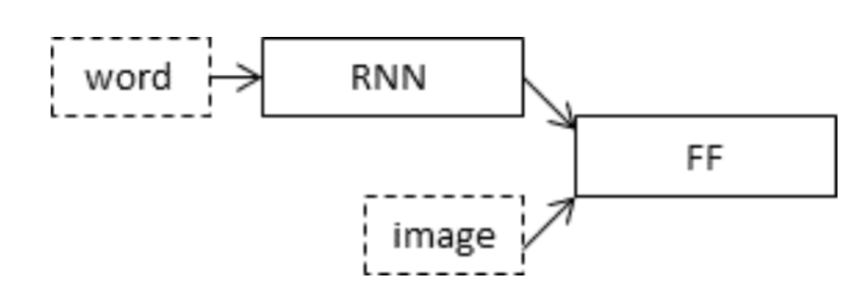

# Image Captioning Model

**What comes to your mind when you see below picture?**

As humans, we can easily caption the images like:
- A white dog in a grassy area **OR**
- White dog with brown spots **OR**
- A dog on grass and some pink flowers.

But, its difficult to make computers understand and tell what the image is about.

-----------------------
But, why do we want computers to learn about images. 
Well, below are some real-world applications of image captioning:
1. **CCTV cameras**
Generate alarms based on video’s captions, which can help to reduce crime/accidents.
2. **Healthcare sector**
Added aid to monitor a patient movements.
Read the X-rays, other images.
3. **Self driving Cars**
Generating captions of surroundings, can help in better self driving systems. 
4. **Aid to the blind**
A product to convert “scene to text (Image captioning)“ and then “text to audio”.
5. **Improve Google Image search experience**
Convert Image to captions.

------------------------
# Data used

I have used Flickr8k dataset, downloaded from Kaggle. 
Reference: https://www.kaggle.com/minhkhoi1026/flickr

**NOTE:** For below files there is an empty line at the end of file, please remove it before loading in jupyter notebook.
Flickr8k.token.txt
Flickr_8k.trainImages.txt
Flickr_8k.testImages.txt
Flickr_8k.devImages.txt

This dataset contains 8000 images in total:
- 6000 train images
- 1000 development images
- 1000 test images
--------------------------
# Methodology used

We have to convert the images and the captions to integers , so that our model can understand them.

### Images to integers
For this problem, we need to extract the features from the images. And the best way to do it is using Convolutional Neural Networks (CNN).

The features from images are extracted with the use of a pre-trained CNN model, **Inceptionv3**.  
This model has 48 layers in total and was developed by GoogleResearch.

This model takes in input of size (299,299,3) and outputs a 1000-category classification.

But, since we are not doing classification, we will extract the features of images from one layer before the output (softmax) layer.

Input size = (299,299,3)
Output size = (2048)

### Text to sequence
To convert text/captions to a sequence of integers, I have used the **_Keras's Tokenizer class_**. 

This is further fed to an **embedding layer** to create a vector which will be the input to the RNN model.

RNN-LSTM (Recurrent Neural Network) is used because the model needs to predict the next word based on the previous word and the image features.

### Merge/Combine the models

Below picture gives an overview of the model structure:

Basically, we are giving the word and the image vector to the RNN model, for it to predict the next word.  
The output of RNN model, is given to a Dense layer (Feed-forward).  
And this process, goes on till RNN sees "endseq" string in the caption, to indicate that it should stop predicting.

Below picture, gives an overview of how LSTMs work:

So, we can see that the LSTM model predicts many words, but we select the output based on highest probability of words and then feed it back to the RNN-LSTM model to further predict the next word.

The final_model configuration is :

# Model Success

To determine, model success, I have used the BLEU metric.

Below is the score:
Saved_Model_name Overall BLEU_score: _model_inception_ep007_acc0.325_loss3.153_val_acc0.315_val_loss3.704.h5_  
BLEU-1: 0.634139  
BLEU-2: 0.404242  

# References
